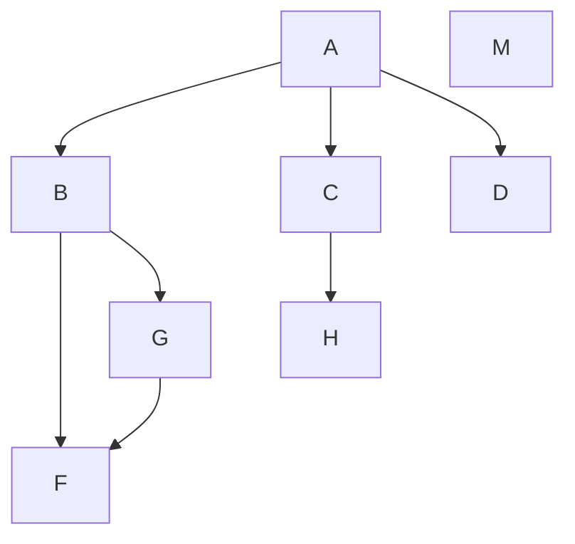
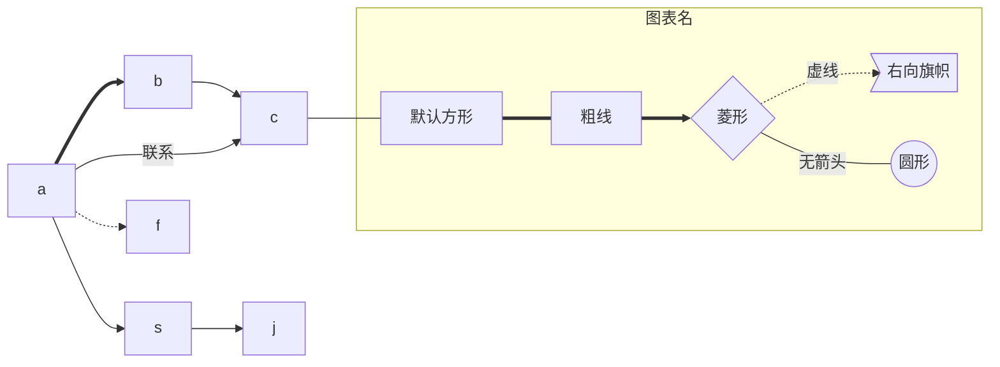
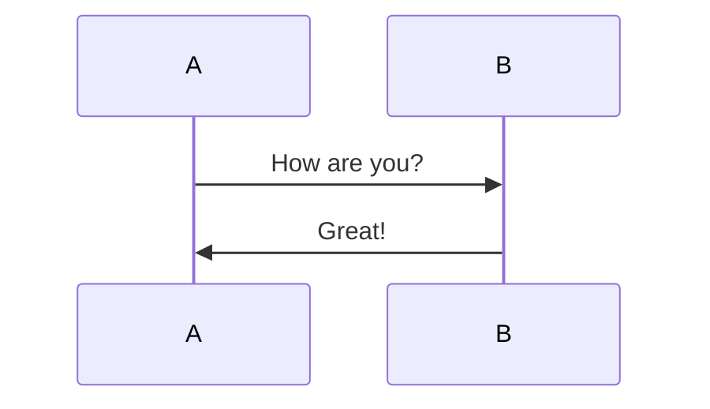
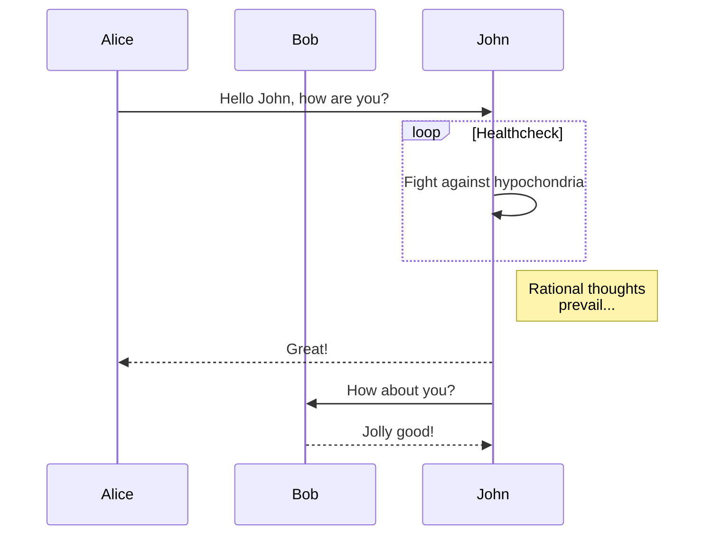
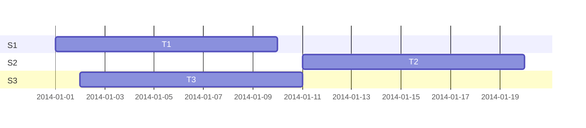
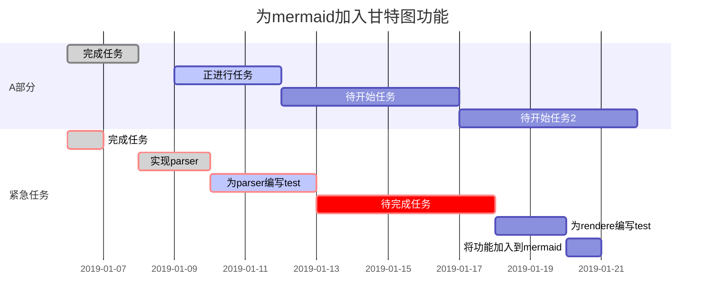

[TOC]

#常用
###折叠
<details>
<summary>折叠</summary>
content!!!
</details>

<details>
  <summary>折叠代码块</summary>
  <pre><code> 
     System.out.println("虽然可以折叠代码块");
     System.out.println("但是代码无法高亮");
  </code></pre>
</details>

<details>
  <summary>折叠代码块</summary>
  <pre><blockcode> 
     System.out.println("虽然可以折叠代码块");
     System.out.println("但是代码无法高亮");
  </blockcode></pre>
</details>

<!--空行、空格 --> 
|项目|价格|
|:-|-|
|computer|$1600|
|phone|$120|
### 空格、空行
&emsp; 
### 有序列表

1. 列表一
	1. 子列表一
2. 列表二
3. 列表三

### 无序列表
 - 列表一
 - 列表二

  + 子列表一
    - 子列表二
  + 子列表三

### 任务表

* [ ] 计划任务
* [x] 已经完成的任务

### 引用、注释

> 引用：https://www.baidu.com
>> This is a sub question.

### 连接
[我的博客地址](http://blog.csdn.net/qq_37656398)
### 角标
H~2~O； 2^10^=1024
### 横线
<!-- 我们可以利用七八个减号或*来定义一根横线 -->
-------
********
### 脚注
 Markdown[^1]
 <!-- 在文章最后面显示脚注 -->
[^1]: Markdown是一种纯文本标记语言 

### github表情
octocat:+1: 这个PR看起来很棒-可以合并了!:smile:

# 文字样式

### 字形
*斜体*、_斜体_
**加粗**
***加粗+斜体***、**_加粗+斜体_**
~~删除线~~  
==背景色==
$\underline{下划线}$ 
Superscript - superscript
^superscript^
Subscript - subscript
~subscript~

### 颜色
<font color=red>This is a question.</font>
<font color=blue>This is a question.</font>
<font color=black>This is a question.</font>
<font color=orange>This is a question.</font>

### 字号
<font size=1>This is a question.</font>
<font size=2>This is a question.</font>
<font size=3>This is a question.</font>
<font size=4>This is a question.</font>
<font size=5>This is a question.</font>
<font size=6>This is a question.</font>
<font size=7>This is a question.</font>

### 字体
<font face="仿宋">我是一句话。</font>
<font face="楷体">我是一句话。</font>
<font face="宋体">我是一句话。</font>
<font face='consolas'>To be or not to be.</font>

### 混合使用
<font color=red><font size=4><font face="仿宋">我是一句话。</font></font></font>

# 代码
`一小块` 
```bash {cmd}
ls .
``` 
```javascript {cmd="node"}
const date = Date.now()
console.log(date.toString())
```

```python {cmd=true id="izdlk700"}
x = 1

``` 
```python {cmd=true id="izdlkdim"}
x = 2
```

```python {cmd=true continue="izdlk700" id="izdlkhso"}
print(x) # will print 1

``` 
```python {cmd=true matplotlib=true}
import matplotlib.pyplot as plt
plt.plot([1,2,3,4])
plt.show() # show figure
```

```html {cmd output="html" class="line-numbers"}
<! DOCTYPE html>
<html lang="en">

<head>
  <meta charset="UTF-8">
  <meta name="viewport" content="width=device-width, initial-scale=1.0">
  <title>Document</title>
</head>

<body>
  <h1>abc</h1>
</body>

</html>

``` 

@import "style/echarts.min.js"
```javascript {cmd=true element="<div id='showechart' style='width:400px;height:300px;'></div>"}
var myChart = echarts.init(document.getElementById('showechart'));
// 指定图表的配置项和数据
var option = {
title: {
    text: 'ECharts 入门示例'
},
tooltip: {},
legend: {
    data:['销量']
},
xAxis: {
    data: ["衬衫","羊毛衫","雪纺衫","裤子","高跟鞋","袜子"]
},
yAxis: {},
series: [{
    name: '销量',
    type: 'bar',
    data: [5, 20, 36, 10, 10, 20]
}]
};
myChart.setOption(option);
```

### 代码块标记
使用Code Chunk功能的代码块必须要使用额外形式做记认. 最基本的是{cmd=true}开启功能.
基本形式是 ` `  ` lang {cmd=your_cmd opt1=value1 opt2=value2 ...} `  ` ` 

* lang 是代码高亮的语言名, 排在最前面.
* cmd 是执行代码块的命令, 可以设置为具体命令, 如cmd="/usr/local/bin/python3".

``` 
当设置为{cmd=true}(或简写成{cmd})时, 将执行前面lang作为主命令.
如果一个属性的值是 true，那么它可以被省略，（e.g. {cmd hide} 和 {cmd=true hide=true} 相同）。
```

* output: html, markdown, text, png, none. 设置如何显示结果.

``` 
text 是默认, 将添加输出结果到一个pre块中显示.
none是隐藏结果.
html是将添加输出结果为html (直接显示, 不在pre块内)
markdown是将输出结果为markdown, 可能会显示不正常.
png将会添加输出结果到base64图片 (实际不显示?)
```

* hide : 设置为true, 会隐藏代码而只显示结果. 默认false
* class="line-numbers" 将会添加代码行数到 code chunk (即代码前显示行号)。
* stdin : 设置为true会将代码传递到stdin而不是作为文件传入.
* id : 可以手动给该code chunk设置一个id号, 可以被后面continue所调用
* continue : 设置为true会继续运行上一个code chunk的内容, 如果设置为continue="id号", 则可以运行指定- id的code chunk的内容. (continue其实就是合并多个code chunk来生成文件来运行).
* class : 如果设置 class="class1 class2"，那么 class1 class2 将会被添加到 code chunk代码块所在- - HTML元素中。默认下该代码块class为language-语言名(便于语法着色).
* element : 设置想要添加的元素, 例如element="\<div id='tester'>\</div>". 有时可以用于在页面加入元素并控制该元素作为显示.
* run_on_save : 设置为true时, 当 markdown 文件被保存时，自动运行 code chunk。默认 false。
* modify_source : 设置为true时, 插入 code chunk 的运行结果直接到 markdown 文件。默认 false。
* matplotlib : 设置为true时, python code chunk 将会在你的预览中绘制图像。

# 数学公式
定义一个行内公式
$f(x)=1*2=\{2\}\\
1+1=2
$

定义一个块级公式
$$1*2=2\\
1+1=2$$

# 各种图

### 流程图

``` flow
//定义类型和描述
st=>start: 开始
e=>end: 结束
op=>operation: 我的操作
cond=>condition: 判断确认？
  
st->op->cond
cond(yes)->e
cond(no)->op
```

``` flow
st=>start: 鉴权
e=>end: 结束退出
cond1=>condition: user==bgbiao
product=ddaotian
productcheck=>condition: ddaotian类型产品库存
(ecs,bss,vpc,eip,hids)
  
  
op1=>operation: 发起预订请求
拆单并库存检测
  
op2=>operation: info:生产指定类型产品
(DAOTIAN:ecs,natip,eip,hids)
op3=>operation: 鉴权失败
op4=>operation: 库存检测失败
  
io1=>inputoutput: 返回产品相关信息
ECS,NATIP,EIP,HIDS
  
io2=>inputoutput: info:无此类型产品
  
  
  
st->cond1
cond1(yes)->op1->productcheck(yes)->op2->io1->e
cond1(no)->op3->e
cond1(yes)->op1->productcheck(no)->op4->io2->e
```





### 时序图

``` puml
bgbiao-> bianbian: good morning
note left of bgbiao: man
bianbian -> bgbiao: eat something
note right of bianbian: woman
  
note over bgbiao: test
```





### 甘特图





### PlantUML
``` puml align="center"
A->B:hello
b->c
```

```puml
   title PXE工作流程
   participant PXE_Client
   participant TFTP_Server
   participant DHCP_Server
   PXE_Client -> DHCP_Server: 请求IP地址
   activate PXE_Client #FFBBBB
   activate DHCP_Server #FFBBCC
   DHCP_Server -> DHCP_Server: 是否为合法的\n来自PXE_Client\n的DHCP请求？
   PXE_Client <-- DHCP_Server: 返回IP地址和bootstrap的位置
   deactivate DHCP_Server
   PXE_Client -> TFTP_Server: 请求传送bootstrap
   activate TFTP_Server #FFAABB
   PXE_Client <-- TFTP_Server: 同意指定传输块大小（blksize）？
   PXE_Client -> TFTP_Server: 同意
   PXE_Client <-- TFTP_Server: 发送bootstrap
   PXE_Client -> PXE_Client: 执行bootstrap(pxelinux.0)
   PXE_Client -> TFTP_Server: 请求传送配置文件\n(pxelinux.cfg/<IP_ADDR>)
   PXE_Client -> PXE_Client: 读配置文件
   PXE_Client -> PXE_Client: 用户根据情况选择
   PXE_Client -> TFTP_Server: 请求传送Linux内核
   PXE_Client <-- TFTP_Server: 发送Linux内核
   PXE_Client -> TFTP_Server: 请求传送Linux根文件系统
   PXE_Client <-- TFTP_Server: 发送Linux根文件系统
   deactivate TFTP_Server
   PXE_Client -> PXE_Client: 启动Linux内核（带参数）
   deactivate PXE_Client
``` 
### Ditaa
```ditaa {cmd=true args=["-E"]}
  +--------+   +-------+    +-------+
  |        | --+ ditaa +--> |       |
  |  Text  |   +-------+    |diagram|
  |Document|   |!magic!|    |       |
  |     {d}|   |       |    |       |
  +---+----+   +-------+    +-------+
      :                         ^
      |       Lots of work      |
      +-------------------------+
```

```ditaa {cmd=true args=["-E"]}  
+---------------------------------------------------------+ 
|                Applications                             |     
|    +----------------------------------------------------+     
|    |           System Libraries                         |     
+----+----------------------------------------------------+     
|                System Call Interface                    |     
+------------------------+--------------+-----------------+       +---------+
|          VFS           |   Socket     |                 |       |         |
+------------------------+--------------+    Scheduler    +-------+   CPU   |
|       File Systems     |   TCP/UDP    |                 |       |         |
+------------------------+--------------+-----------------+       +----+----+
|       Volume Manager   |   IP         |    Virtual      |            |  
+------------------------+--------------+    Memory       |            |
| Block Device Interface |   Ethernet   |                 |            |
+------------------------+--------------+-----------------+       +----+----+
|                       Device Driver                     |       |  DRAM   |
+-----------------------------+---------------------------+       +---------+
                              |            
                              |            
                      +-------+--------+          
                      |   I/O Bridge   |          
                      +-------+--------+          
                              |                            
                              |                  
      ------+-----------------+--------------------+------  
            |                                      |     
  +---------+--------+                  +----------+---------+
  |  I/O Controller  |                  | Network Controller |
  +-+-------+------+-+                  +----+----------+----+
    |       |      |                         |          |
+---+---+   |  +---+---+                +----+----+ +---+----+
| Disk  |  ... | Swap  |                |  Port   | |  Port  |
+-------+      +-------+                +---------+ +--------+  
```

```ditaa {cmd=true args=["-E"]} 
   +---------------------------------------+
   |                Applications           |
   |                cRED                   |
   +-------------------+                   |
   |    cBLU           |                   |
   |    Libraries      |                   |
   +-------------------+-------------------+
   |                                       |
   |   Kernel          +-------------------+
   |   cYEL            |           cGRE    |
   |           +-------+--------+  Drivers |
   |           |   Firmware c1AF|          |
   +-----------+----------------+----------+
   |               Hardware  c1AC          |
   +---------------------------------------+
```
